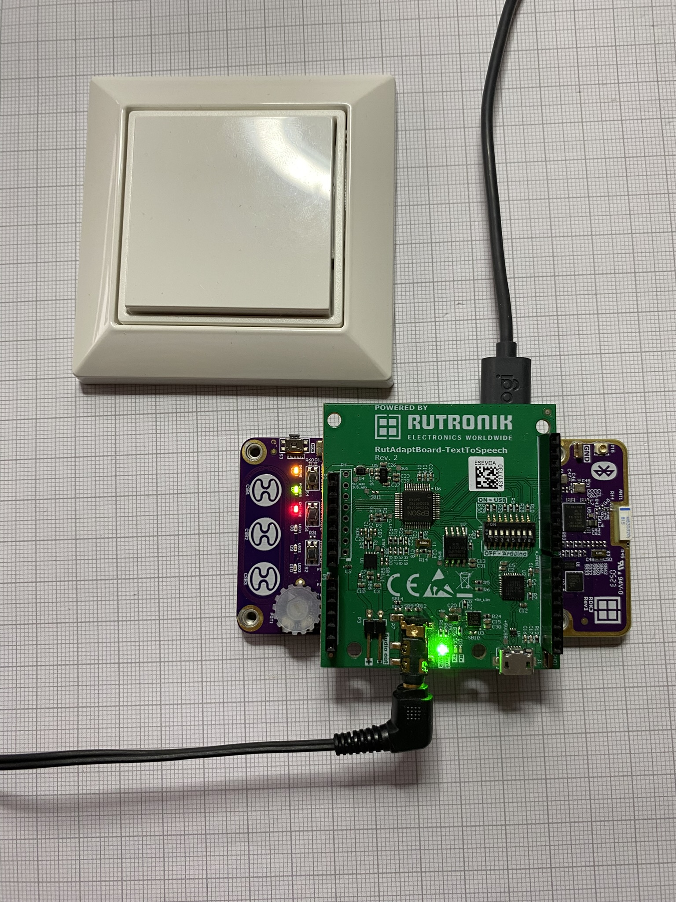
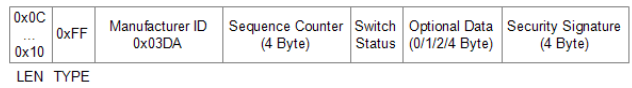
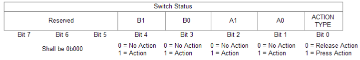
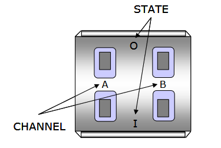
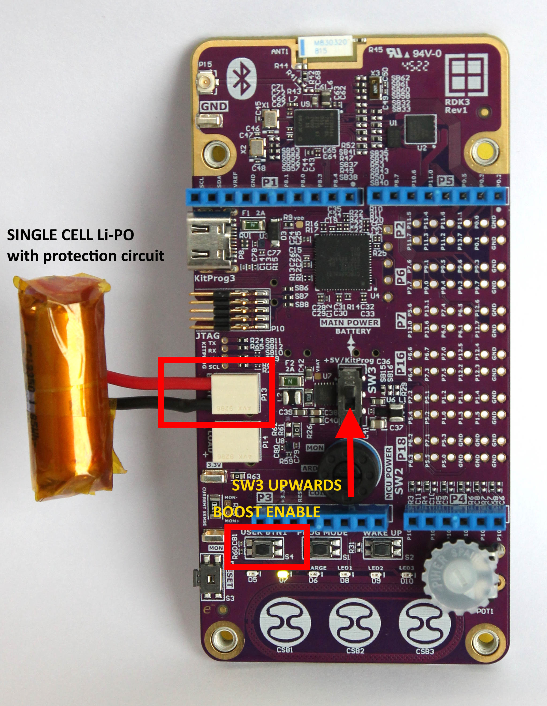

# RDK3 BLE EnOcean

This example illustrates how to use a RDK3 to listen to telegrams of EnOcean BLE switches PTM216B.

Once a EnOcean telegram has been received (and has been considered as a valid telegram), if the source is inside the database, a text message is played by the TextToSpeech board.

To add a device into the database, press the USER BTN1 of the RDK3. This will add the next device that sends a valid EnOcean telegram into the database.




## Structure of the EnOcean BLE message



Remark: type (0xFF) and Manufacturer ID (0x03DA) are for PTM216B. Other EnOcean sensors might have other type and manufacturer ID.

Example when receiving a telegram from a switch (after beeing pressed or released):

```
Data length : 13 
Address is: E2:15:00:05:F2:FC 
Length: 12 
Type: 0xff 
Manufacturer ID: 0x3da 
Counter: 836 
Switch status: 0x8 
Retval = 0 
```

The switch status field looks like following:



So for the example above:
```
Switch status: 0x8 -> B0 has been released
```

## Requirements

- [ModusToolbox® software](https://www.infineon.com/cms/en/design-support/tools/sdk/modustoolbox-software/) **v3.x** [built with **v3.2**]
- [RDK3](https://www.rutronik24.com/product/rutronik/rdk3/20820185.html)
- [TextToSpeech](https://www.rutronik24.com/product/rutronik/rabtexttospeech/14219206.html)

For Modus Toolbox version 3.2 and more, you need to install Python manually.
1. [Python](https://www.python.org/) has to be installed manually on Windows OS.
2. Make sure Python installation is added to the path variable. 
3. Use this command to install the [cysecuretools](https://pypi.org/project/cysecuretools/) package:

```
pip install cysecuretools
```

### Provisioning of the RDK3

The CYB06447BZI-BLD53 device must be provisioned with keys and policies before being programmed.

Please follow the instructions of the [user manual](https://github.com/RutronikSystemSolutions/RDK3_Documents/blob/main/RDK3_user's_manual.pdf).

### Powering the RDK3 from the single-cell Li-ION/Li-PO battery

The RAB4-RTK adapter board needs to be powered from a +5V power supply source via Arduino Headers. If the USB-C cable is connected with RDK3 and PC, the power is already supplied without any additional setup. 

To make this demo portable and use it with Li-PO(or Li-ION) batteries, the OTG booster needs to be activated. This demo has a very simple method implemented which allows users to enable the boost mode of the [DIO59020](https://www.dioo.com/uploads/product/20210520/9fdd66c936d397ab75a4638578b09190.pdf) charger just by pressing a button USER BTN1. The 

- Connect the single-cell Li-PO or Li-ION battery, please respect the polarity. It would be best if the battery would have an internal protection circuit integrated.

- Switch the SW3 upwards to the "BATTERY" position.

- Mount the RAB4-RTK adapter board.

- Press and hold the button USER_BTN1 and then press and release a RESET Button. Notice if the GREEN LED D7 - "POWER" lights up.

- Release the USER_BTN1. The YELLOW blinking LED1 D8 indicates that the system is running and is ready for connection with a smartphone via Bluetooth LE. 

  NOTICE 1: this demo does not have power-saving and self-shutting down algorithms implemented yet. The switch SW3 must be switched down to the +5V/KitProg position if the development kit is not used. This is especially important if you are using batteries without the protection circuits integrated (never allow for the voltage of the battery to fall below 3 volts).

  NOTICE 2: The charging will not work if the boost mode is engaged. You need to restart the demo without pressing USER_BTN1.

  NOTICE 3: The battery charging current may be adjusted in code in `battery_booster.c`:

  ```c
      	/*The charging current depends on your battery used*/
      	dio_set_batt_current(CURR_VREF_101_8);
  ```



## Legal Disclaimer

The evaluation board including the software is for testing purposes only and, because it has limited functions and limited resilience, is not suitable for permanent use under real conditions. If the evaluation board is nevertheless used under real conditions, this is done at one’s responsibility; any liability of Rutronik is insofar excluded. 


